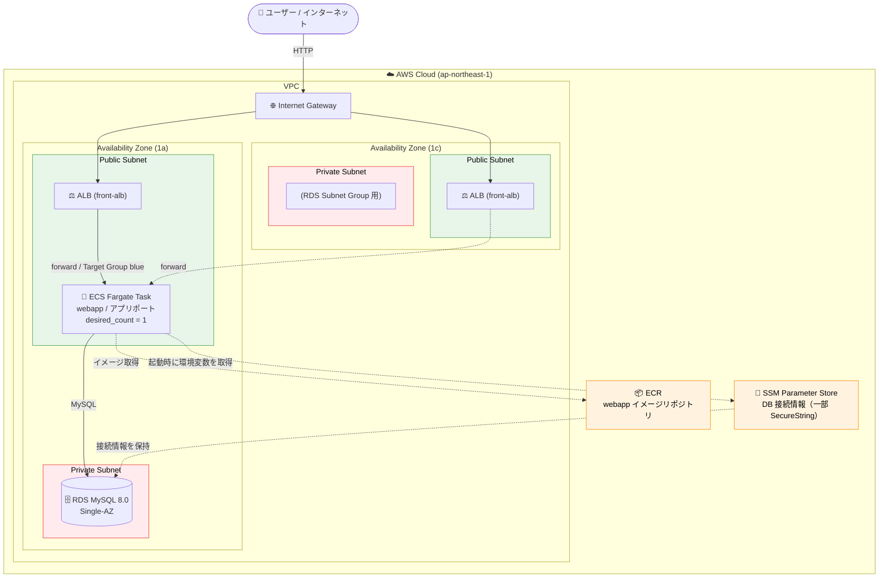
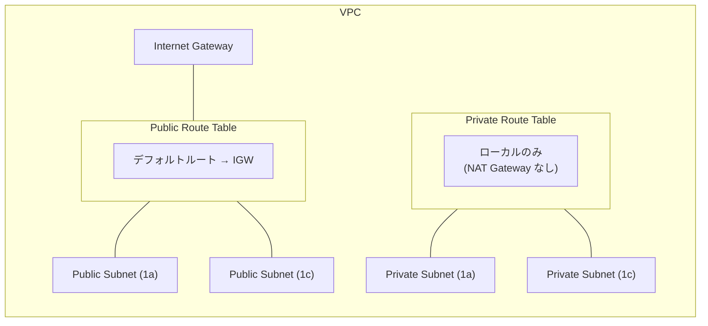
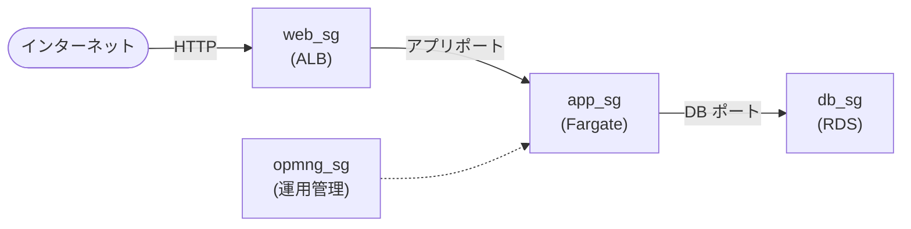

# tastylog インフラ構成図

`10_infra/` 配下の Terraform から構築される AWS リソース構成です。
GitHub 上でこの Markdown を開くと、下の Mermaid 図がそのまま図として表示されます。

- **リージョン**: 東京 (`ap-northeast-1`)
- **環境**: `dev`
- **ネットワーク**: VPC 内に Public / Private サブネットを 2 AZ に配置（具体的な CIDR は Terraform 管理）

> ℹ️ セキュリティ上の理由から、内部 CIDR・DB エンジンの詳細パッチバージョン・シークレット保管パスなどの具体値はこのドキュメントには記載していません。実際の値は Terraform コード／tfstate（非公開）を参照してください。

## 全体構成図

## ネットワーク / ルーティング

> 🔸 Private Subnet は NAT Gateway を持たないため、外向き通信はできません（RDS 専用）。これにより NAT のコストは発生しません。

## セキュリティグループの通信フロー

## リソース一覧

| カテゴリ | リソース | 主な設定 |
|---|---|---|
| ネットワーク | VPC | 2 AZ 構成 |
| ネットワーク | Public Subnet ×2 | AZ 1a / 1c |
| ネットワーク | Private Subnet ×2 | AZ 1a / 1c |
| ネットワーク | Internet Gateway | Public RT にデフォルトルート |
| ロードバランサ | ALB (`front-alb`) | HTTP リスナー → Target Group へ転送 |
| ロードバランサ | Target Group ×2 | blue / green（Blue-Green デプロイ用） |
| コンテナ | ECS Cluster | `webapp-cluster`（Container Insights 無効） |
| コンテナ | ECS Service (Fargate) | `desired_count = 1` / public IP 付与 |
| コンテナ | ECS Task Definition | 最小スペック（vCPU/メモリ）/ アプリポート公開 |
| コンテナ | ECR | `webapp`（scan_on_push 有効） |
| データベース | RDS MySQL 8.0 | `db.t3.micro` クラス / Single-AZ / gp2 |
| 設定管理 | SSM Parameter Store | DB 接続情報（一部 SecureString） |
| IAM | ECS タスク実行ロール | - |

## デプロイ構成のポイント

- **Blue-Green デプロイ**: Target Group が `blue` / `green` の2つ用意されており、CodeDeploy 等での切り替えデプロイを想定。
- **シークレット管理**: DB 接続情報は SSM Parameter Store に保存し、Fargate タスク起動時に環境変数として注入（実際の値・パラメータパスはコード／コンソールで管理）。
- **冗長性**: ALB は 2AZ にまたがる一方、RDS と Fargate タスクは Single-AZ 構成（dev 環境のためコスト優先）。